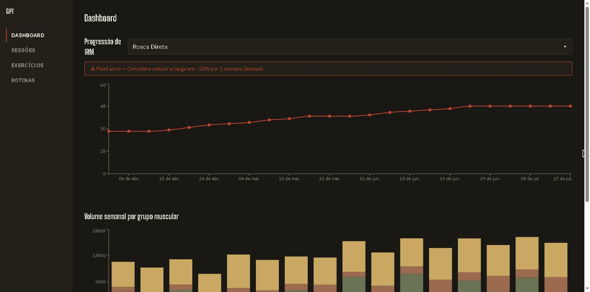

# LiftCurve

[](https://github.com/Raphael-Sinelli/liftcurve/actions/workflows/ci.yml?query=branch%3Adevelop)


Rastreador de progressão de treino de força com estimativa de 1RM, agregação de volume por
grupo muscular e detecção automática de platô.

**App em produção:** [liftcurve.vercel.app](https://liftcurve.vercel.app)

## O problema

A maioria dos apps de treino para nesse nível: registrar séries, pesos, repetições. LiftCurve
vai além — cada série registrada alimenta uma camada de domínio que transforma número bruto
em decisão de treino:

- **1RM estimado** (Epley + Brzycki) por série, calculado em tempo real.
- **Volume semanal** agregado por grupo muscular, ao longo de toda a janela de treino.
- **Detecção automática de platô** — 3 sessões consecutivas sem novo recorde de 1RM disparam
  um alerta com sugestão de deload. É o diferencial real do projeto: a parte que a maioria
  dos apps de treino de portfólio não tem, porque exige regra de negócio de verdade, não só
  CRUD.

Projeto de portfólio autoral, construído full-stack (Java/Quarkus + React/TypeScript) do
zero, sprint a sprint, com TDD, revisão de código real a cada etapa, e deploy completo em
produção.

## Stack e decisões de arquitetura

| Camada | Escolha |
|---|---|
| Backend | Java 21, Quarkus, Hibernate/Panache (Repository pattern), Flyway |
| Auth | JWT (access token HS256) + refresh token opaco rotacionado, BCrypt |
| Frontend | React 19, TypeScript, Vite, TanStack Query, React Router, Recharts, Tailwind CSS |
| Testes | JUnit 5 (unitário) + Testcontainers/RestAssured (integração) no backend, Vitest + Testing Library + MSW no frontend |
| Infra | Docker Compose (3 serviços), GitHub Actions (lint+test+build+docker-build em paralelo) |
| Deploy | Backend no [Render](https://render.com) (Docker), frontend na [Vercel](https://vercel.com) |

Resumo — pra quem quiser se aprofundar nas decisões e no processo:
- [`docs/superpowers/specs/`](docs/superpowers/specs/) — design original completo do projeto
  e specs detalhadas de sprints individuais.
- [`docs/superpowers/plans/`](docs/superpowers/plans/) — plano de implementação task-a-task
  de cada sprint, incluindo os bugs reais encontrados e corrigidos em cada revisão de código.
- [`docs/DEPLOY.md`](docs/DEPLOY.md) — passo a passo completo de deploy (Render + Vercel).

## Dashboard



## Conta demo

O projeto inclui uma conta pública com histórico de treino já populado (16 semanas, 48
sessões, 6 exercícios em 5 grupos musculares, incluindo 1 exercício com platô proposital) —
pra testar o app sem precisar cadastrar nada, direto em produção.

**Credenciais** (fixas, propositalmente públicas — essa conta não guarda nenhum dado
sensível, é 100% sintética; ver decisão de design em
`docs/superpowers/plans/2026-07-25-sprint4-api-polish-seed.md`):

- Email: `demo@gymtracker.app`
- Senha: `DemoGymTracker2026!`

O que você vai ver logando com essa conta:
- **Progressão de 1RM**: gráfico crescente em 5 dos 6 exercícios ao longo de ~4 meses.
- **Volume semanal**: agregado por grupo muscular, toda a janela de 16 semanas.
- **Alerta de platô**: "Rosca Direta" (Bíceps) mostra platô ativo — carga travada nas últimas
  5 sessões, feature de detecção funcionando de ponta a ponta.
- 2 rotinas pré-montadas ("Treino A" e "Treino B").

O dashboard (`/dashboard`, tela inicial após login) mostra esses dados de verdade — gráfico
de progressão de 1RM por exercício, volume semanal por grupo muscular, e a lista de alertas
de platô — construído com Recharts sobre os mesmos endpoints. A aba "Sessões" deixa
registrar um treino novo (com ou sem rotina base), adicionar séries em tempo real e ver o
1RM estimado de cada uma, e finalizar o treino.

## Como rodar localmente

Pré-requisitos: Java 21, Node 20+, Docker Desktop.

```bash
# sobe os 3 serviços (Postgres + backend + frontend)
docker compose up -d --build
```

Abre `http://localhost:8081` — a conta demo já vem populada (`GYMTRACKER_SEED_DEMO=true` é o
default no Compose).

Alternativa em modo dev (hot reload):

```bash
# sobe só o Postgres
docker compose up -d postgres

# backend (http://localhost:8080)
cd backend
./mvnw quarkus:dev      # Windows: mvnw.cmd quarkus:dev

# frontend (http://localhost:5173)
cd frontend
npm install
npm run dev      # chamadas de API são encaminhadas pro backend via proxy do Vite (vite.config.ts), não precisa configurar VITE_API_BASE_URL em dev
```

Ligar a seed em modo dev (desligada por padrão nesse caminho — nunca roda sozinha em
dev/test/CI): setar a env var `GYMTRACKER_SEED_DEMO=true` antes de subir a aplicação. Roda
uma única vez no boot (idempotente):

```bash
GYMTRACKER_SEED_DEMO=true ./mvnw quarkus:dev      # Windows: set GYMTRACKER_SEED_DEMO=true && mvnw.cmd quarkus:dev
```

## Testes

```bash
# backend — unitários (sem Docker)
cd backend && ./mvnw test

# backend — integração (precisa de Docker rodando)
cd backend && ./mvnw verify

# frontend
cd frontend
npm run lint    # oxlint
npm run test    # Vitest + Testing Library + MSW
npm run build   # tsc -b && vite build
```

## Deploy

Backend no [Render](https://render.com) (Docker), frontend na [Vercel](https://vercel.com).
Passo a passo completo de configuração (variáveis de ambiente, CORS, CSP) em
[`docs/DEPLOY.md`](docs/DEPLOY.md).

- Frontend: https://liftcurve.vercel.app
- Backend (API): https://liftcurve.onrender.com

## Status

- [x] Sprint 0 — Fundações
- [x] Sprint 1 — Schema + Auth
- [x] Sprint 2 — Exercícios + Rotinas
- [x] Sprint 3 — Sessões + Domínio Core (1RM, volume, platô)
- [x] Sprint 4 — API polish + Seed
- [x] Sprint 5a — Frontend Core (Fundação + Auth + Exercícios + Rotinas)
- [x] Sprint 5b — Frontend Sessões + Dashboard (Recharts)
- [x] Sprint 6 — Testes, CI/CD, Deploy
- [x] Sprint 7 — README final + Polish
