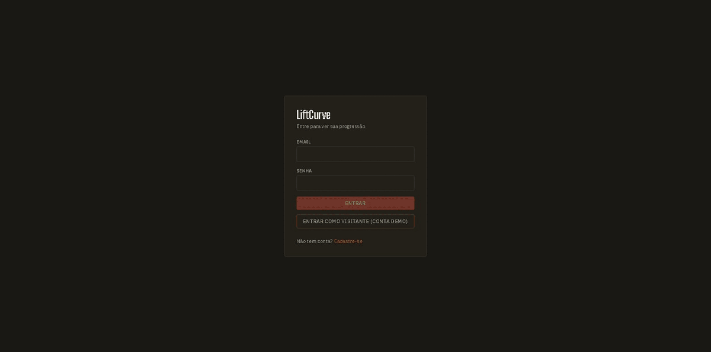
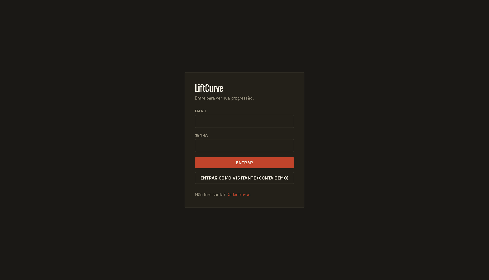
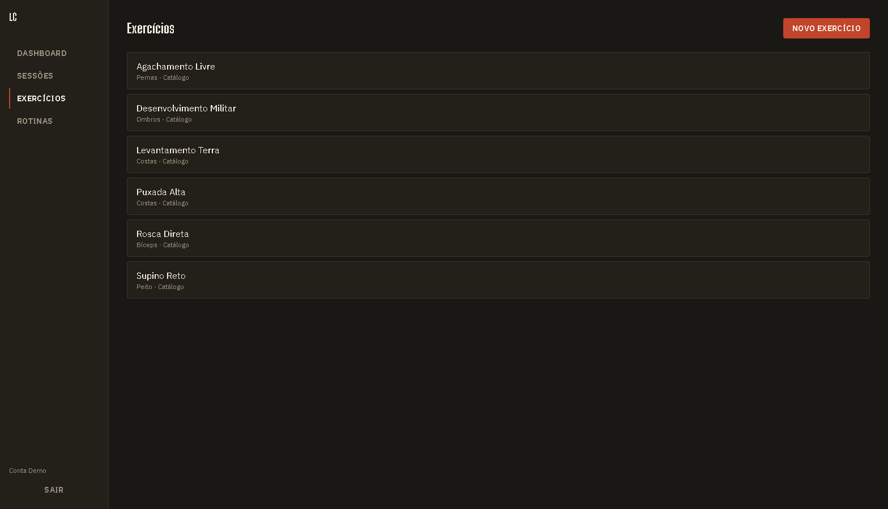
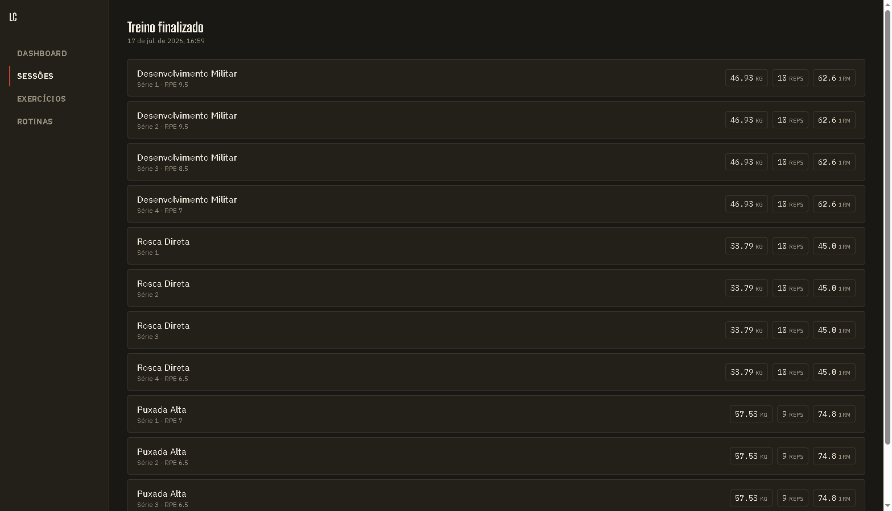
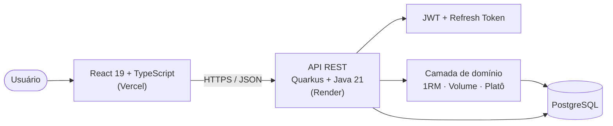

# LiftCurve

Rastreador de progressão de treino de força — estimativa de 1RM, volume por grupo
muscular, detecção automática de platô.

<p align="center">
  
</p>

[](https://github.com/Raphael-Sinelli/liftcurve/actions/workflows/ci.yml?query=branch%3Adevelop)


[](https://shields.io)
**App em produção:** [liftcurve.vercel.app](https://liftcurve.vercel.app)

## O problema

A maioria dos apps de treino param nesse nível: registrar séries, pesos, repetições.
LiftCurve vai além — cada série registrada alimenta uma camada de domínio que transforma
número bruto em decisão de treino:

- **1RM estimado** (Epley + Brzycki) por série, calculado em tempo real.
- **Volume semanal** agregado por grupo muscular, ao longo de toda a janela de treino.
- **Detecção automática de platô** — 3 sessões consecutivas sem novo recorde de 1RM
  disparam um alerta com sugestão de deload.

Esse último ponto é o diferencial real do projeto: a camada que a maioria dos apps de
treino de portfólio não tem, porque exige regra de negócio de verdade, não só CRUD.

Projeto de portfólio autoral, construído full-stack (Java/Quarkus + React/TypeScript) do
zero, sprint a sprint, com TDD, revisão de código real a cada etapa, e deploy completo em
produção.

## Diferenciais

O que separa o LiftCurve de um CRUD de treino comum:

- **1RM estimado por 2 fórmulas** (Epley + Brzycki) — usa o maior valor entre as duas em
  vez de uma estimativa única e arbitrária.
- **Detecção automática de platô** — 3 sessões consecutivas sem novo recorde disparam
  alerta com sugestão de deload; o usuário não precisa perceber o platô sozinho.
- **Volume semanal por grupo muscular** — agregação real sobre o histórico completo de
  treino, não uma lista solta de séries.
- **Processo de revisão em camadas** — cada sprint passou por revisão de task e depois
  revisão de branch inteira antes do merge, e isso pegou bugs reais (não cosméticos) em
  quase toda sprint: uma property de configuração errada que quebrava toda a autenticação,
  uma condição de corrida na exclusão de exercício em uso, estado de loading incorreto em
  3 telas, 3 problemas reais de CORS. Detalhes na seção [Aprendizados](#aprendizados).

## Funcionalidades

- Cadastro e login com JWT (access token + refresh token opaco rotacionado)
- Catálogo de exercícios global + exercícios customizados por usuário
- Construtor de rotinas de treino (exercícios, séries, reps, carga planejada)
- Registro de sessão de treino com séries em tempo real (peso, reps, RPE opcional)
- Cálculo automático de 1RM estimado a cada série
- Dashboard com progressão de 1RM, volume semanal por grupo muscular e alertas de platô
- Conta demo pública com 16 semanas de histórico de treino simulado

## Screenshots

<p align="center">
  
  
</p>
<p align="center">
  
  
</p>

## Conta demo

O projeto inclui uma conta pública com histórico de treino já populado (16 semanas, 48
sessões, 6 exercícios em 5 grupos musculares, incluindo 1 exercício com platô proposital) —
pra testar o app sem cadastro, direto em produção.

**Credenciais** (fixas, propositalmente públicas — conta 100% sintética, sem dado
sensível; decisão documentada em
`docs/superpowers/plans/2026-07-25-sprint4-api-polish-seed.md`):

- Email: `demo@gymtracker.app`
- Senha: `DemoGymTracker2026!`

O que você vai ver ao logar — o dashboard (`/dashboard`, tela inicial pós-login) é
construído com Recharts sobre os mesmos endpoints da API:

- **Progressão de 1RM**: gráfico crescente em 5 dos 6 exercícios ao longo de ~4 meses.
- **Volume semanal**: agregado por grupo muscular, toda a janela de 16 semanas.
- **Alerta de platô**: "Rosca Direta" (Bíceps) com carga travada nas últimas 5 sessões —
  a detecção funcionando de ponta a ponta.
- **Sessões**: aba pra registrar um treino novo (com ou sem rotina base), adicionar séries
  em tempo real com 1RM calculado na hora, e finalizar o treino.
- 2 rotinas pré-montadas ("Treino A" e "Treino B").

## Stack e decisões de arquitetura

| Camada | Escolha |
|---|---|
| Backend | Java 21, Quarkus, Hibernate/Panache (Repository pattern), Flyway |
| Auth | JWT (access token HS256) + refresh token opaco rotacionado, BCrypt |
| Frontend | React 19, TypeScript, Vite, TanStack Query, React Router, Recharts, Tailwind CSS |
| Testes | JUnit 5 (unitário) + Testcontainers/RestAssured (integração) no backend, Vitest + Testing Library + MSW no frontend |
| Infra | Docker Compose (3 serviços), GitHub Actions (lint+test+build+docker-build em paralelo) |
| Deploy | Backend no [Render](https://render.com) (Docker), frontend na [Vercel](https://vercel.com) |

Pra quem quiser se aprofundar nas decisões e no processo:
- [`docs/superpowers/specs/`](docs/superpowers/specs/) — design original completo do projeto
  e specs detalhadas de sprints individuais.
- [`docs/superpowers/plans/`](docs/superpowers/plans/) — plano de implementação task-a-task
  de cada sprint, incluindo os bugs reais encontrados e corrigidos em cada revisão de código.
- [`docs/DEPLOY.md`](docs/DEPLOY.md) — passo a passo completo de deploy (Render + Vercel).

## Arquitetura



## Estrutura do projeto

```text
gym-progress-tracker/
├── backend/                                # Quarkus (Java 21)
│   ├── src/main/java/com/rsinelli/gymtracker/
│   │   ├── resource/                   # Endpoints REST
│   │   ├── service/                    # Regras de negócio (1RM, volume, platô)
│   │   ├── repository/                 # Panache Repository (acesso a dado)
│   │   ├── entity/                     # Entidades JPA
│   │   ├── dto/                        # Request/response (records)
│   │   ├── exception/                  # Exceções + ExceptionMapper
│   │   ├── security/                   # JWT, CurrentUser, hashing
│   │   └── seed/                       # Seed da conta demo
│   ├── src/main/resources/db/migration/  # Migrations Flyway
│   └── src/test/java/.../
│       ├── unit/                         # Testes unitários (calculators)
│       └── integration/                  # Testes de integração (Testcontainers)
├── frontend/                               # Vite + React + TypeScript
│   └── src/
│       ├── api/                          # Clientes HTTP por domínio
│       ├── components/                   # UI compartilhada (Button, Modal, PlateStat...)
│       ├── context/                      # AuthContext
│       ├── lib/                          # apiClient, caseConversion, formatDate...
│       ├── routes/                       # AppLayout, ProtectedRoute
│       └── features/                     # auth/, exercises/, routines/, sessions/, dashboard/
├── docs/                                   # Specs, plans, screenshots, DEPLOY.md
├── docker-compose.yml                      # Postgres + backend + frontend
└── README.md
```

## Como rodar localmente

Pré-requisitos: Java 21, Node 20+, Docker Desktop.

```bash
# sobe os 3 serviços (Postgres + backend + frontend)
docker compose up -d --build
```

Abre `http://localhost:8081` — a conta demo já vem populada (`GYMTRACKER_SEED_DEMO=true` é o
default no Compose).

Alternativa em modo dev (hot reload):

```bash
# sobe só o Postgres
docker compose up -d postgres

# backend (http://localhost:8080)
cd backend
./mvnw quarkus:dev      # Windows: mvnw.cmd quarkus:dev

# frontend (http://localhost:5173)
cd frontend
npm install
npm run dev      # chamadas de API são encaminhadas pro backend via proxy do Vite (vite.config.ts), não precisa configurar VITE_API_BASE_URL em dev
```

Ligar a seed em modo dev (desligada por padrão nesse caminho — nunca roda sozinha em
dev/test/CI): setar a env var `GYMTRACKER_SEED_DEMO=true` antes de subir a aplicação. Roda
uma única vez no boot (idempotente):

```bash
GYMTRACKER_SEED_DEMO=true ./mvnw quarkus:dev      # Windows: set GYMTRACKER_SEED_DEMO=true && mvnw.cmd quarkus:dev
```

## Testes

```bash
# backend — unitários (sem Docker)
cd backend && ./mvnw test

# backend — integração (precisa de Docker rodando)
cd backend && ./mvnw verify

# frontend
cd frontend
npm run lint    # oxlint
npm run test    # Vitest + Testing Library + MSW
npm run build   # tsc -b && vite build
```

## Deploy

Backend no [Render](https://render.com) (Docker), frontend na [Vercel](https://vercel.com).
Passo a passo completo de configuração (variáveis de ambiente, CORS, CSP) em
[`docs/DEPLOY.md`](docs/DEPLOY.md).

- Frontend: https://liftcurve.vercel.app
- Backend (API): https://liftcurve.onrender.com

## Aprendizados

Cada sprint deste projeto passou por revisão de código real antes do merge — task por
task, e depois uma revisão de branch inteira. Isso pegou bugs reais, não só nitpicks de
estilo:

- **Autenticação nunca validava token de verdade** (Sprint 2): a property de configuração
  estava com o nome errado (`mp.jwt.verify.secretkey` em vez de
  `smallrye.jwt.verify.secretkey`, o correto para chave simétrica). Como o MicroProfile
  Config ignora properties desconhecidas silenciosamente, isso nunca gerou erro — só nunca
  funcionou, porque nunca tinha sido exercitado (Sprint 1 só emitia token, nunca validava).
- **Condição de corrida na exclusão de exercício em uso** (Sprint 2): deletar um exercício
  referenciado numa rotina podia estourar uma violação de integridade referencial não
  tratada. Corrigido capturando a violação no boundary do banco (`SQLState 23503`) e
  traduzindo pra um erro 409 claro, em vez de checar-e-deletar (que reabriria o mesmo tipo
  de condição de corrida).
- **Estado de loading incorreto em 3 telas** (Sprint 5b): queries do React Query
  desabilitadas (`enabled: false`) retornavam `isLoading: true` mesmo sem nunca terem
  disparado — as telas ficavam presas num skeleton infinito.
- **3 problemas reais de CORS** (Sprint 6): property de configuração errada, comportamento
  de origem não permitida nunca verificado contra o app real, e a necessidade do header
  `Access-Control-Allow-Credentials` — todos descobertos só quando o CORS ganhou um teste
  de integração de verdade, não suposição.
- **Fallback de SPA faltando em produção** (revisão final da Sprint 6): o `vercel.json` não
  tinha o rewrite pra `index.html` — atualizar a página em qualquer rota client-side (ex.
  `/dashboard`) devolvia 404 do Vercel.

Histórico completo de cada bug, decisão e correção está em
[`docs/superpowers/plans/`](docs/superpowers/plans/).

## Autor

Raphael Sinelli

Tecnólogo em Análise e Desenvolvimento de Sistemas — FIAP

- GitHub: https://github.com/Raphael-Sinelli
- LinkedIn: https://www.linkedin.com/in/raphael-sinelli-675310321/
- E-mail: raphaelsinelli@gmail.com
