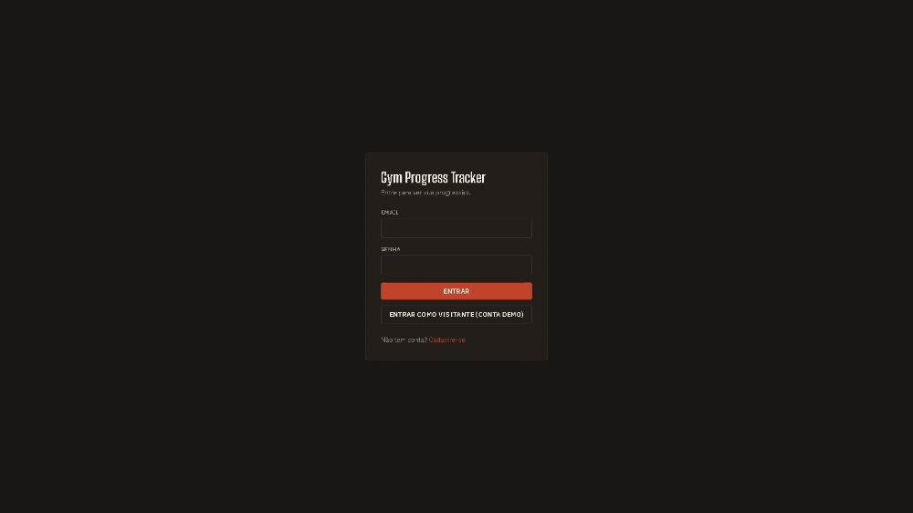
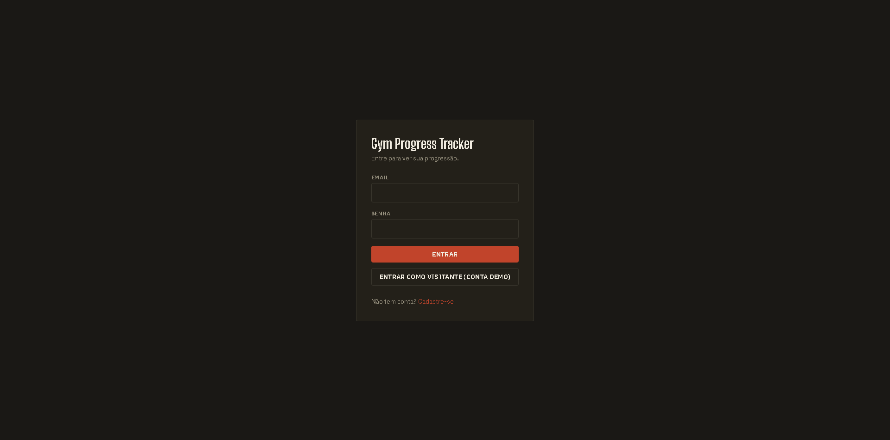
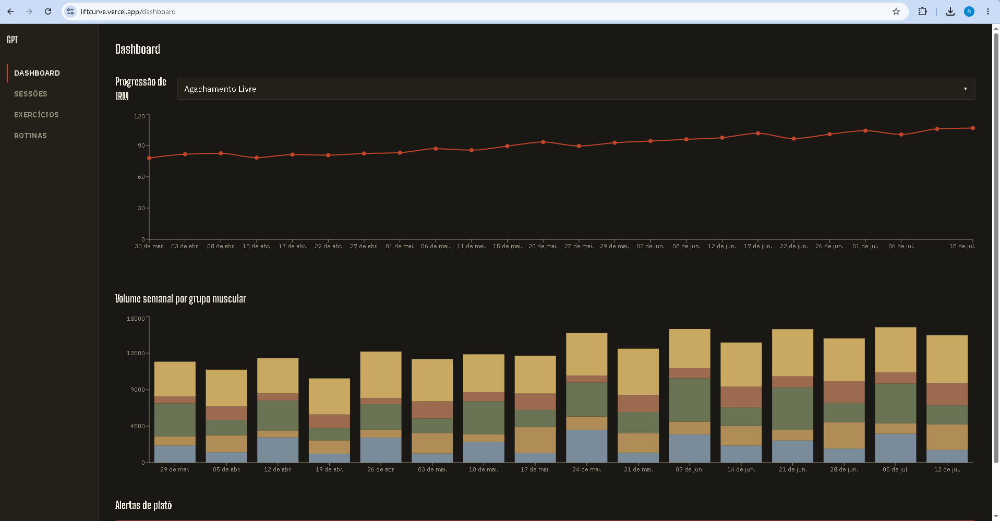
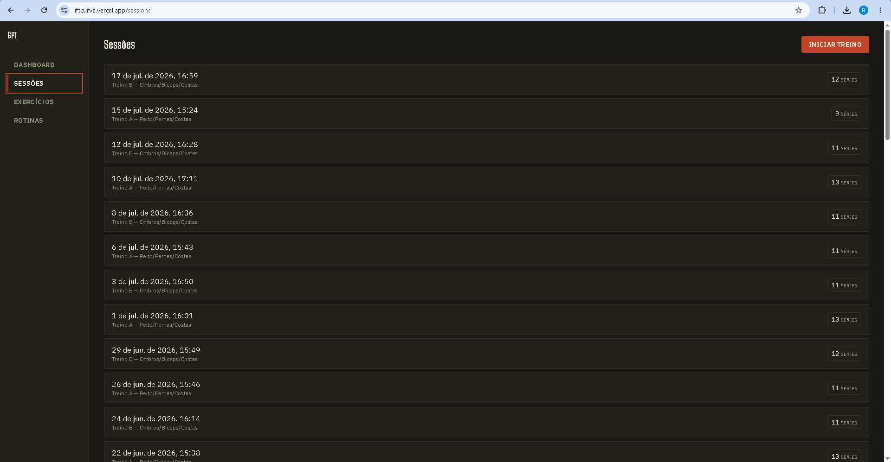
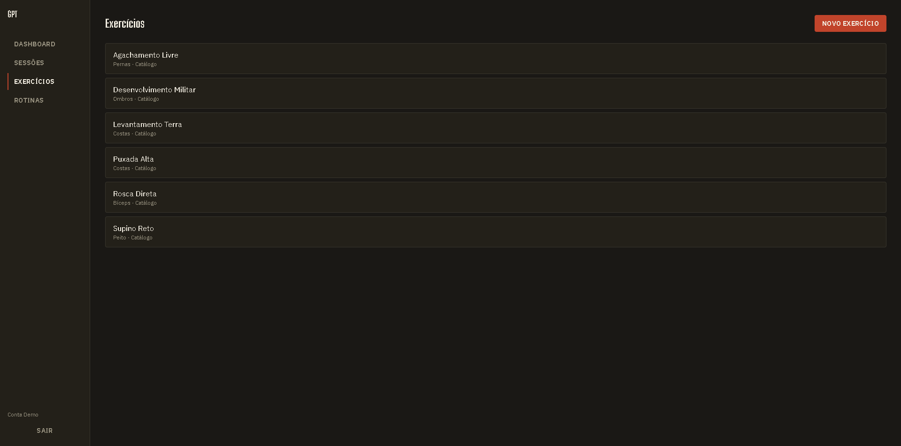
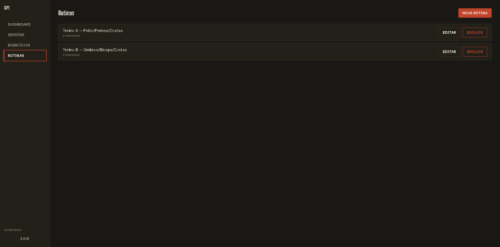

# 🏋️ LiftCurve

<p align="center">
  
</p>

<p align="center">


</p>

LiftCurve is a full-stack workout tracking application built with **Java, Quarkus, React and TypeScript**. It allows users to organize workout routines, manage exercises, record training sessions and monitor strength progression through interactive analytics.

## 🚀 Live Demo

**Application:** https://liftcurve.vercel.app

A pre-populated **Demo Account** is available directly from the login screen through **"Entrar como Visitante (Conta Demo)"**, allowing recruiters to explore every feature immediately.

---

# ✨ Features

- JWT Authentication
- Workout session management
- Exercise library
- Training routines
- One Rep Max (1RM) progression chart
- Weekly training volume analytics
- Interactive dashboard
- Responsive interface

---

# 📸 Screenshots

## Login



## Dashboard



## Workout Sessions



## Exercise Library



## Training Routines



---

# 🛠 Tech Stack

## Backend

- Java 21
- Quarkus
- PostgreSQL
- Flyway
- JWT Authentication
- Maven

## Frontend

- React
- TypeScript
- Vite
- Tailwind CSS
- React Router
- Axios
- Recharts

## DevOps

- Docker
- Docker Compose
- GitHub Actions
- Render
- Vercel

---

# 🏗 Architecture

```text
React + TypeScript
        │
 REST API (Quarkus)
        │
 Business Layer
        │
   PostgreSQL
```

---

# 🚀 Running Locally

## Prerequisites

- Java 21
- Node.js
- Docker Desktop

## Clone

```bash
git clone https://github.com/Raphael-Sinelli/liftcurve.git
```

## Backend

```bash
cd backend
./mvnw quarkus:dev
```

## Frontend

```bash
cd frontend
npm install
npm run dev
```

---

# 🧪 Running Tests

Backend

```bash
./mvnw test
```

Frontend

```bash
npm run test
```

---

# 📁 Project Structure

```text
backend/
frontend/
docs/
```

---

# 👨‍💻 Author

**Raphael Oliveira Sinelli Mendonça**

GitHub: https://github.com/Raphael-Sinelli

LinkedIn: https://linkedin.com/in/raphael-sinelli-675310321
