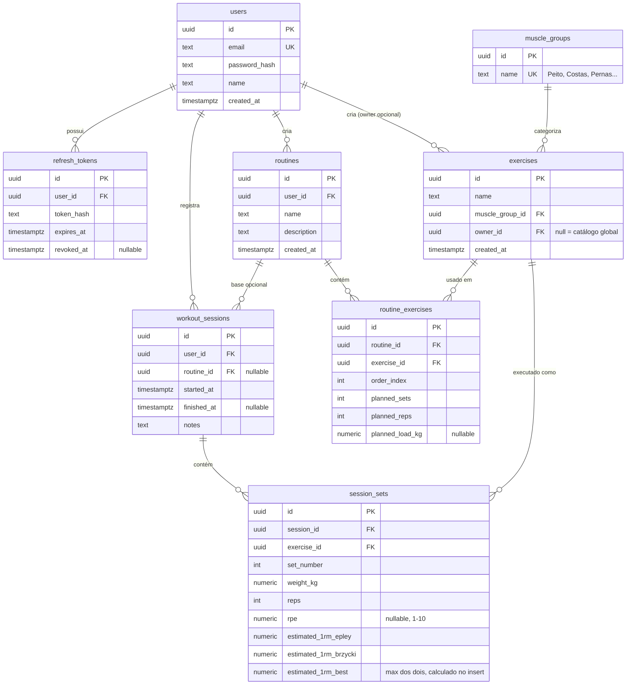

# gym-progress-tracker — Design + Plano de Sprints

## Contexto

Projeto de portfólio autoral pra demonstrar capacidade de engenharia full-stack/back-end
em processos de estágio (ADS/FIAP). Não é clone raso de app de treino — o diferencial é
a camada de domínio (1RM estimado, volume por grupo muscular, detecção de platô, progressão
sugerida em templates). Sem vínculo com Casa Sinelli.

Prioridade confirmada: full-time, ritmo rápido, **sem cortar qualidade** (testes reais,
README completo, segurança). MVP funcional primeiro, refino depois. Alvo secundário:
recrutador consegue testar o app **sem cadastrar nada** — login demo com histórico já
populado (meses de treino simulado) pra dashboard/gráficos aparecerem prontos.

Decisões já validadas com o usuário (não reabrir sem motivo):
- Auth: JWT + refresh token (access curto + refresh longo, rota de refresh e logout real)
- Detecção de platô: N=3 sessões consecutivas sem novo 1RM, fixo no sistema (não configurável)
- RPE: escala 1-10, campo opcional por série
- Biblioteca de exercícios: catálogo global (seed, sem dono) + exercícios custom por usuário (owner_id)
- Conta demo pública com dados seed (obrigatória pro portfólio)

---

## Decisões de Arquitetura

| Camada | Escolha | Por quê |
|---|---|---|
| Backend | Java 21 + Quarkus 3.37.3 (Maven) | Stack pedida. Quarkus = startup rápido, dev mode com hot reload, extensions maduras pra JWT/OpenAPI/Flyway |
| Persistência | Hibernate ORM + Panache **Repository pattern** (não Active Record) | Repository explícito = DAO de verdade, injetado no Service (BO). Entities ficam POJO puro (getters/setters), sem lógica de persistência misturada |
| Migrations | Flyway | Versionamento de schema auditável, roda automático no boot em dev/CI |
| IDs | UUID em todas as tabelas, gerado em Java (`UUID.randomUUID()`) | Evita enumeration attack em endpoints públicos; gerar em Java (não via generator do Hibernate) simplifica testes e inserts diretos |
| Auth | Access token = JWT HS256 (SmallRye JWT Build API), Refresh token = string opaca aleatória (256 bits) com hash SHA-256 em banco | Refresh token opaco permite revogação real (delete/flag no banco) sem precisar de blacklist de JWT. JWT não é adequado pra refresh token porque não dá pra revogar um JWT já emitido sem estado extra — então cortamos o meio de campo: JWT só pro access token de vida curta |
| Hash de senha | BCrypt (`io.quarkus.elytron.security.common.BcryptUtil`) | Extension oficial Quarkus. Senha limitada a 72 chars na validação porque BCrypt trunca silenciosamente acima disso |
| Erros | `ExceptionMapper` central → shape `{error:{code,message,status,details}}` | Mesmo contrato que o front já espera consumir (regra global de error handling) |
| JSON | Jackson com `quarkus.jackson.property-naming-strategy=SNAKE_CASE` | Código Java em camelCase, JSON em snake_case — mesma convenção do resto do stack |
| Frontend | React 19 + TS + Vite 8, Tailwind v4, Recharts, TanStack Query, React Router, Axios c/ interceptors | Stack pedida. React Query evita boilerplate de cache/loading; interceptors fazem a conversão camelCase↔snake_case automática |
| Testes back | JUnit 5 — **unitário puro** (`*Test.java`, roda com `mvn test`, zero Docker) pra regras de negócio, **Testcontainers + RestAssured** (`*IT.java`, roda com `mvn verify`) pra fluxo real via Postgres em container | Regra de negócio não precisa de banco pra ser testada — só integração/repositório precisa. Split *Test/*IT deixa a CI rodar unitário sem Docker se precisar |
| Testes front | Vitest + Testing Library | Padrão React/Vite |
| Infra local | Docker Compose (postgres + backend + frontend), 1 comando sobe tudo | Pedido explícito. Sprint 0 sobe só Postgres; os outros 2 serviços entram no Sprint 6 quando os Dockerfiles existirem |
| CI | GitHub Actions — lint + test + build em cada PR, back e front em paralelo | Testcontainers roda nativo em runner Ubuntu do Actions (Docker já disponível) |
| Deploy | Backend → Render (Docker), Frontend → Vercel | Pedido explícito |

---

## Estrutura de Pastas (monorepo)

```
gym-progress-tracker/
├── backend/                          # Quarkus (Maven)
│   ├── src/main/java/com/rsinelli/gymtracker/
│   │   ├── resource/                 # REST endpoints (Controller)
│   │   ├── service/                  # BO — regras de negócio
│   │   ├── repository/               # DAO — Panache Repository pattern
│   │   ├── entity/                   # JPA entities
│   │   ├── dto/                      # request/response records
│   │   ├── exception/                # custom exceptions + ExceptionMapper
│   │   └── security/                 # JWT issue/validate, password hash
│   ├── src/main/resources/db/migration/   # Flyway V1__..., V2__...
│   ├── src/test/java/.../unit/       # regras de negócio, sem Postgres (*Test.java)
│   ├── src/test/java/.../integration/  # Testcontainers + RestAssured (*IT.java)
│   └── Dockerfile                    # criado no Sprint 6
├── frontend/                          # Vite + React + TS
│   └── src/
├── docker-compose.yml
├── .github/workflows/ci.yml
└── README.md
```

---

## Modelagem de Dados (DER)



Notas de design:
- `estimated_1rm_*` fica **denormalizado** em `session_sets`, calculado pelo Service no
  momento do insert.
- Platô **não vira tabela própria**: é computado on-the-fly no endpoint de dashboard.
- `muscle_groups` é tabela de lookup (seed fixo), não enum de banco.

*(Só `users` e `refresh_tokens` são criadas no Sprint 1 — as demais tabelas entram nos
Sprints 2-3 conforme o plano de implementação.)*

---

## Regras de Negócio Centrais (o que precisa de teste de verdade)

**1RM estimado** (`OneRepMaxCalculator`, unitário, sem banco) — Sprint 3:
- Epley: `1RM = peso × (1 + reps/30)`
- Brzycki: `1RM = peso × 36 / (37 - reps)`
- `estimated_1rm_best = max(epley, brzycki)`
- Casos de borda: `reps=1`, `reps>=37` (Brzycki indefinido → guard clause), `reps` alto (>12)

**Volume de treino** (`VolumeCalculator`, unitário) — Sprint 3:
- `volume = Σ(sets × reps × peso)` agrupado por `muscle_group` e por semana (UTC)

**Detecção de platô** (`PlateauDetectionService`, unitário) — Sprint 3:
- Precisa de no mínimo 4 sessões registradas do exercício pra avaliar
- Regra: se `max(1RM das últimas 3 sessões) <= 1RM da sessão anterior a essa janela` →
  sinaliza platô

---

## API (visão geral)

| Recurso | Verbos |
|---|---|
| `/auth` | POST `/register`, POST `/login`, POST `/refresh`, POST `/logout` |
| `/exercises` | GET, POST, PUT `/{id}`, DELETE `/{id}` |
| `/routines` | GET, POST, GET `/{id}`, PUT `/{id}`, DELETE `/{id}` |
| `/workout-sessions` | GET, POST, GET `/{id}`, PATCH `/{id}`, POST `/{id}/sets` |
| `/dashboard` | GET `/progression/{exerciseId}`, GET `/volume`, GET `/plateaus` |

---

## Plano de Sprints (full-time, ritmo diário)

**Sprint 0 — Fundações (dia 1):** scaffold backend+frontend, docker-compose (Postgres), CI esqueleto, README inicial.

**Sprint 1 — Schema + Auth (dias 2-3):** migrations, register/login/refresh/logout com JWT+BCrypt, testes de integração (Testcontainers). vibesec aplicado aqui.

**Sprint 2 — Exercícios + Rotinas (dias 4-5):** CRUD exercícios (global+custom), CRUD rotinas com `routine_exercises`.

**Sprint 3 — Sessões + Domínio Core (dias 6-8):** registro de sessão/séries, `OneRepMaxCalculator`, `VolumeCalculator`, `PlateauDetectionService` — cobertura de teste pesada.

**Sprint 4 — API polish + Seed (dias 9-10):** OpenAPI completo, seed de conta demo com histórico simulado (incluindo 1 platô proposital).

**Sprint 5 — Frontend Core (dias 11-14):** auth pages, biblioteca, construtor de rotina, log de sessão, dashboard com Recharts. frontend-design skill aplicado.

**Sprint 6 — Testes, CI/CD, Deploy (dias 15-17):** Vitest, docker-compose completo (3 serviços), CI completo, deploy Render+Vercel, CORS travado, revisão vibesec final.

**Sprint 7 — README + Polish (dia 18):** README completo, QA manual.

Fora do MVP: reset de senha por email, N de platô configurável, notificação assíncrona de platô, papéis coach/aluno.

---

## Ambiente de desenvolvimento (registrado em 2026-07-23)

- Java 21 (Temurin) instalado via winget, `JAVA_HOME` setado.
- Maven 3.9.16 instalado manualmente em `C:\tools\apache-maven-3.9.16` (sem instalador winget disponível), adicionado ao PATH do usuário.
- Docker Desktop 4.83.0 instalado via winget — **primeira abertura manual pendente** (aceitar termos, inicializar WSL2) antes de `mvn verify` (Testcontainers) ou `docker compose up` funcionarem.
